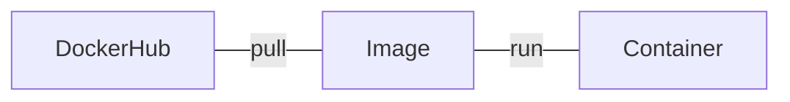

## docker

목표

* docker 가 어떻게 동작하는지 알기
* docker 로 nginx 간단한 서버 실행해보기

## Docker Flow

[](https://mermaid-js.github.io/mermaid-live-editor/edit#eyJjb2RlIjoiZmxvd2NoYXJ0IExSXG4gICAgRG9ja2VySHViLS0gcHVsbCAtLS1JbWFnZXMtLSBydW4gLS0tIENvbnRhaW5lciIsIm1lcm1haWQiOiJ7XG4gIFwidGhlbWVcIjogXCJkZWZhdWx0XCJcbn0iLCJ1cGRhdGVFZGl0b3IiOmZhbHNlLCJhdXRvU3luYyI6dHJ1ZSwidXBkYXRlRGlhZ3JhbSI6ZmFsc2V9)



## images

이미지 리스트 보기

```bash
docker images
```

```bash
REPOSITORY   TAG       IMAGE ID       CREATED      SIZE
httpd        latest    ea28e1b82f31   8 days ago   143MB
```

### pull : image 내려받기

[hub.docker.com](https://hub.docker.com/) > Explore 에서 사용하고 싶은 image 를 찾을 수 있음

```bash
docker pull nginx
```

## container

### run : image 를 가지고 container 실행하기

```bash
docker run nginx
```

특정 포트 지정하려면..

```bash
docker run -p 8080:80 nginx
```

컨테이너 이름을 정하자

```bash
docker run --name ws2 -p 8080:80 nginx
```

위 커맨드 실행 후 `localhost:8080` 접속하면 nginx 가 실행되었음을 확인할 수 있다.

### stop & start

컨테이너를 종료하고 싶다면 container id 나 name 을 입력하여 해당 컨테이너를 종료할 수 있따.

```bash
docker stop ws2
```

재가동은 

```bash
docker start ws2
```

### ps : container 목록 보기

```bash
docker ps
```

```bash
CONTAINER ID   IMAGE          COMMAND                  CREATED          STATUS          PORTS                  NAMES
2058cdbcccd8   nginx          "/docker-entrypoint.…"   5 minutes ago    Up 5 minutes    0.0.0.0:8080->80/tcp   stupefied_easley
42ee7b6670f5   httpd:latest   "httpd-foreground"       42 minutes ago   Up 42 minutes   80/tcp
```

stop 된 컨테이너도 보고 싶다면...

```bash
docker ps -a
```

### rm : 컨테이너 삭제

실행중인 컨테이너는 제거할 수 없다.

```bash
docker rm ws2
```