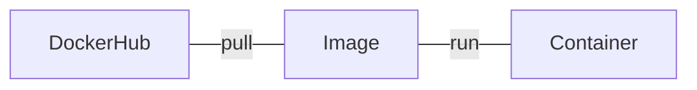

## docker

목표

* docker 가 어떻게 동작하는지 알기
* docker 로 nginx 간단한 서버 실행해보기

## Docker Flow

[](https://mermaid-js.github.io/mermaid-live-editor/edit#eyJjb2RlIjoiZmxvd2NoYXJ0IExSXG4gICAgRG9ja2VySHViLS0gcHVsbCAtLS1JbWFnZXMtLSBydW4gLS0tIENvbnRhaW5lciIsIm1lcm1haWQiOiJ7XG4gIFwidGhlbWVcIjogXCJkZWZhdWx0XCJcbn0iLCJ1cGRhdGVFZGl0b3IiOmZhbHNlLCJhdXRvU3luYyI6dHJ1ZSwidXBkYXRlRGlhZ3JhbSI6ZmFsc2V9)



## images

이미지 리스트 보기

```bash
docker images
```

```bash
REPOSITORY   TAG       IMAGE ID       CREATED      SIZE
httpd        latest    ea28e1b82f31   8 days ago   143MB
```

### pull

[hub.docker.com](https://hub.docker.com/) > Explore 에서 사용하고 싶은 image 를 찾을 수 있음

```bash
docker pull nginx
```

### run

```
docker run nginx
```

특정 포트 지정하려면..

```bash
docker run -p 8080:80 nginx
```

위 커맨드 실행 후 `localhost:8080` 접속하면 nginx 가 실행되었음을 확인할 수 있다.